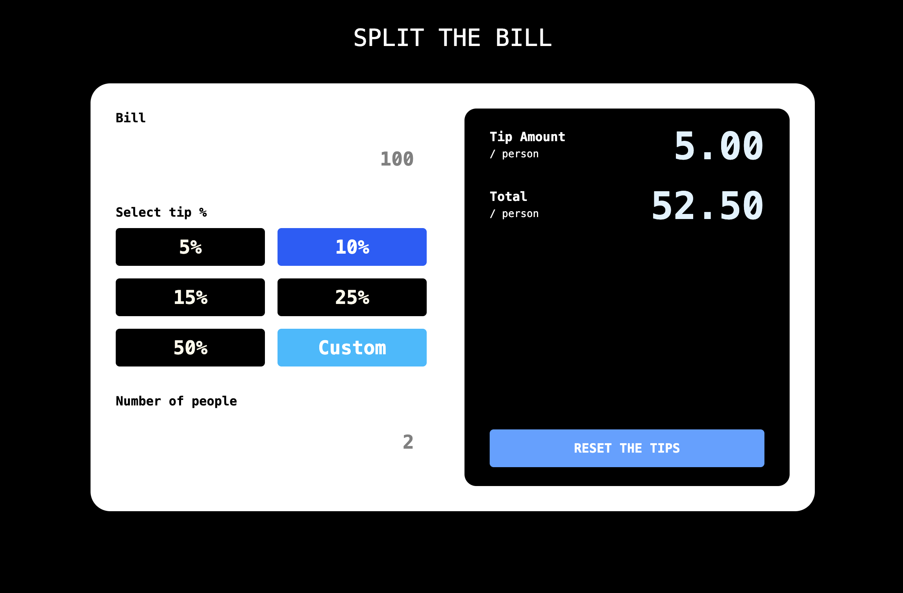

# React Tip Calculator

A modern **Tip Calculator App** built with **React + TypeScript**, powered by **Zustand** for state management and **GSAP** for premium UI micro-interactions.

This project is part of my portfolio, designed to demonstrate **clean React architecture, state handling, component design, and polished UI/UX animations**.

---

## Screenshot

## 

## Features

- **Bill & People inputs** with validation (no zero for people, decimals allowed for bill).
- **Preset tip selection** (5%, 10%, 15%, 25%, 50%) with active state highlighting.
- **Custom tip input** with:
  - Char-by-char reveal animation.
  - Validation (1–100%).
  - Auto-routing to preset buttons if matches (5/10/15/25/50).
- **Reset button** that restores initial state without reloading the page.
- **GSAP animations** inspired by Awwwards websites:
  - Magnetic hover.
  - Glossy sheen sweep.
  - Pulse on commit.
  - Shake on invalid input.
- **Responsive UI** (mobile-first, TailwindCSS).

---

## Tech Stack

- [React 18](https://react.dev/) + [TypeScript](https://www.typescriptlang.org/)
- [Zustand](https://docs.pmnd.rs/zustand/getting-started/introduction) – lightweight global state store
- [Tailwind CSS](https://tailwindcss.com/) – utility-first styling
- [GSAP](https://greensock.com/gsap/) – high-performance animations
- Vite – fast dev/build tool

---

## Getting Started

Clone the repo:

```bash
git clone https://github.com/yourusername/react-tip-calculator.git
cd react-tip-calculator
```

Install dependencies

```bash
npm install
```

Run locally

```bash
npm run dev
```

Build for production

```bash
npm run build
```

---

## Code Highlights

    •	CustomButton.tsx → Custom tip field with GSAP micro-interactions (magnetic hover, sheen sweep, pulse & shake).
    •	PercentButton.tsx → Preset tip selection with active state binding to the store.
    •	Calculator.store.ts → Zustand store with full state + reset method.

---

## Purpose

This project was built to practice and showcase:
• Writing clean, typed React components.
• State management with Zustand (an alternative to Redux).
• UI polish with GSAP, inspired by modern award-winning websites.
• Developer experience improvements with TypeScript + Vite.

---

## Contact

    •	Portfolio: simoneconti.work
    •	GitHub: github.com/simoneconti.work
    •	LinkedIn: linkedin.com/in/simonecontidev/
    •	Email: simonecontisid@gmail.com
